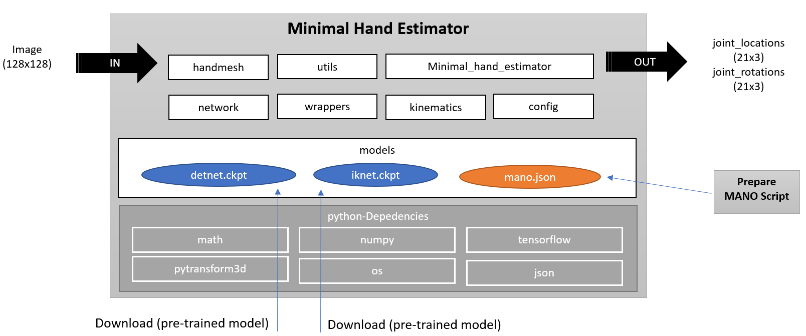
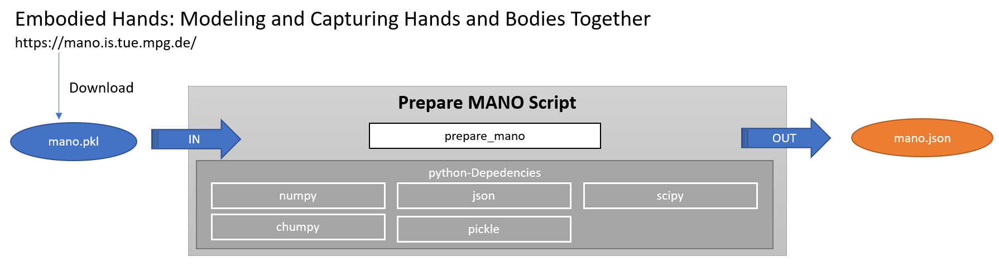

# 3D hand pose estimation based on 'Minimal Hand'

[Minimal Hand: official github project](https://github.com/CalciferZh/minimal-hand)

### Differences compared to official Minimal Hand project

- Upgrade to tensorflow 2.8.0 compatibility
- Added calculation function to get relative joint angles out of absolute joint angles. This is very helpful in case of using joint angles for hand model with a kinematic chain
- The preparation code allows to create a MANO JSON file, so the dependencies for PAZ runtime environment is lower
- Added PAZ pipeline and demo script
- Added some fix MANO test poses

for more details, please checkout files
- minimal_hand_estimator.py
- prepare_mano.py

## System architecture

## Prepare MANO hand model

## Installation
### Install dependencies
- pypaz
- pytransform3d==1.11.0

### Prepare MANO hand model
1. Download MANO model from [here](https://mano.is.tue.mpg.de/) and unzip it.
2. In `config.py`, set `OFFICIAL_MANO_LEFT_PATH` to the **left hand** model 'MANO_LEFT.pkl'.
3. In `config.py`, set `OFFICIAL_MANO_RIGHT_PATH` to the **right hand** model 'MANO_RIGHT.pkl'.
4. For the single preparation-step, please install following dependencies. (All dependencies are available via pip and conda)

- chumpy==0.70
- scipy==1.7.3
- pytransform3d==1.11.0

5. Run `python prepare_mano.py`, you will get the converted MANO model that is compatible with this project at `config.HAND_MESH_MODEL_LEFT_PATH_JSON` and `config.HAND_MESH_MODEL_RIGHT_PATH_JSON`

### Prepare pre-trained network models
1. Download models from [here](https://github.com/CalciferZh/minimal-hand/releases/download/v1/cvpr_2020_hand_model_v1.zip).
1. Put `detnet.ckpt.*` in `model/detnet`, and `iknet.ckpt.*` in `model/iknet`.
1. Check `config.py`, make sure all required files are there.

### Run the demo for webcam input
1. `python paz_demo.py`
2. Put your **right hand** in front of the camera. The pre-trained model is for left hand, but the input would be flipped internally.
3. Press `ESC` to quit.

