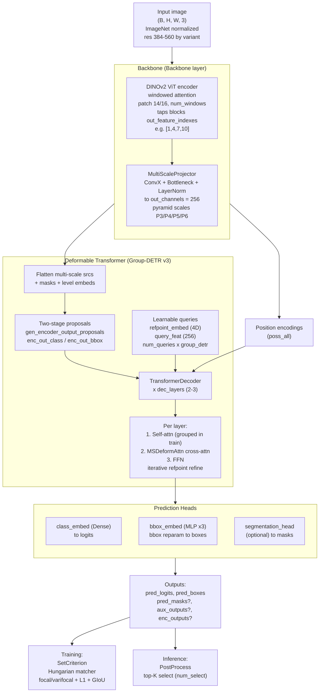

# RF-DETR Architecture

Architecture of the RF-DETR object detector as implemented in this directory
(DINOv2 backbone + multi-scale projector + deformable Group-DETR decoder).

## Key components

- **Backbone** (`models/backbone/backbone.py`): a `DinoV2` windowed-attention
  ViT feeds a `MultiScaleProjector` that emits 256-channel pyramid features.
- **Transformer** (`models/transformer_decoder_head/transformer.py`): two-stage
  encoder proposals + a decoder stack where each layer does self-attention,
  multi-scale deformable cross-attention (`MSDeformAttn`), and an FFN, with
  iterative reference-point refinement.
- **Queries** (`models/lwdetr/lwdetr.py`): `num_queries x group_detr` learnable
  reference points + features; all groups used in training, only the first
  group at inference.
- **Heads**: `class_embed` (Dense) and `bbox_embed` (3-layer MLP with bbox
  reparameterization), plus an optional segmentation head.
- **Variants** (`config.py`): Nano/Small/Base/Medium/Large differ in
  resolution, patch size, window count, decoder layers, and tapped block
  indices.
