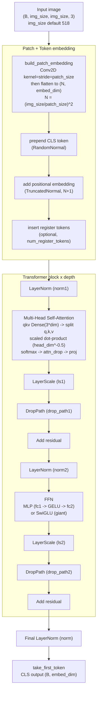
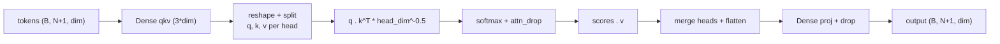

# DINOv2 Architecture

Architecture of the DINOv2 Vision Transformer as implemented in this directory
(functional Keras `DinoVisionTransformer` in `models/vision_transformer.py`
with layer builders under `layers/`).



## Block residual flow

Each block applies two pre-norm residual branches (DINOv2 / ViT style):

```
x = x + DropPath(LayerScale(Attention(LayerNorm(x))))
x = x + DropPath(LayerScale(FFN(LayerNorm(x))))
```

## Variants

| Builder      | embed_dim | depth | heads | FFN    |
| ------------ | --------- | ----- | ----- | ------ |
| `vit_small`  | 384       | 12    | 6     | MLP    |
| `vit_base`   | 768       | 12    | 12    | MLP    |
| `vit_large`  | 1024      | 24    | 16    | MLP    |
| `vit_giant2` | 1536      | 40    | 24    | SwiGLU |

Shared defaults: `patch_size=14`, `img_size=518`, `mlp_ratio=4.0`,
`init_values=1e-5`, qkv/proj/ffn bias enabled, `drop_path_rate=0.0`.

## Key components

- **Patch embedding** (`layers/patch_embed.py`): a single `Conv2D` with
  kernel and stride equal to `patch_size` projects non-overlapping patches,
  then reshapes to a token sequence.
- **Token stream** (`models/vision_transformer.py`): prepends a learnable
  CLS token, adds learnable positional embeddings, and optionally inserts
  register tokens after the CLS token.
- **Attention** (`layers/attention.py`): fused `qkv` Dense projection, head
  split, scaled dot-product attention with softmax and dropout, output
  projection.
- **FFN** (`layers/mlp.py`, `layers/swiglu_ffn.py`): standard GELU MLP for
  small/base/large; fused SwiGLU for the giant variant.
- **LayerScale** (`layers/layer_scale.py`): per-channel learnable scaling via
  `EinsumDense`, applied to each residual branch when `init_values` is set.
- **DropPath** (`layers/drop_path.py`): stochastic depth on residual branches
  (identity when the rate is 0).
- **Head**: final `LayerNorm` followed by selecting the CLS token as the
  model output.

## Attention internals


